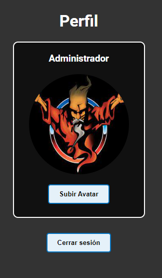

# Tiny Forum

A very light and simple forum programmed with React for learning pourposes only.

The idea was to create a basic forum structure using as few dependencies as possible.

<p align="center">

</p>

## Features

Basic implemented features:

- Topics and posts
- User register and login
- Bcrypted passwords
- Rich text WYSIWYG editor for post
- Avatar upload
- MySQL database

<p align="center">
<tr>
<td valign="top"></td>
<td valign="top"></td>
</tr>
<tr>
<td valign="top"></td>
<td valign="top"></td>
</tr>
</p>

## Tools

- Visual Studio Code
- MySQL Community Server 8.0.31
- MySQL Workbench 8.0 CE

## Tech Stack

**Client:**

- Vite + React
- Quill (for text editor)

**Server:**

- Node
- Express
- MySql2

**Others:**

- Multer (upload avatars)
- Bcrypt (password hashing)
- Nodemon (backend "hot reload")
- Concurrently (start client and server at same time)

## Deployment

Clone repository:

```
git clone https://github.com/IDandT/tiny-forum
```

Install dependencies:

```
cd tiny-forum
npm install
```

Create database structure:

In database folder you can found a batch file to create full database, tables and stored procedures. Edit create_database.bat and set your mysql installation path and user settings:

```
set mysqlpath="C:\Program Files\MySQL\MySQL Server 8.0\bin\mysql.exe "
set host=localhost
set user=dev
set pass=dev
```

Go to database folder and launch script:

```
cd server\database
create_database.bat
```

If you have any problem, you can also run all SQL files manually.

The "data.sql" script creates a record for admin user in "users" table. By default:

- User: "Administrador"
- Pass: "Ab123456"

## Environment Variables

To run this project, you will need to add the following environment variables to your .env file.

### Client

Set backend API url access:

```
VITE_API_ENDPOINT=http://localhost:3000
```

### Server

Set MySQL database configuration, season expiration time in minutes, and avatar settings (the server folder to store images, and full static URL to get images from client)

```
PORT=3000
MYSQL_HOST=localhost
MYSQL_DATABASE=idandt_tinyforum
MYSQL_USERNAME=dev
MYSQL_PASSWORD=dev
MYSQL_PORT=3306
EXPIRATION_MINUTES=60
AVATAR_FOLDER=avatars/
AVATAR_URL=http://localhost:3000/avatars/
```

## Run project

The project has a script to run both frontend and backend simultaneously (thanks to "concurrently" package used in dependencies).
Return to root dir and run project:

```
npm run dev
```

You can also run the client and server separately using the running script in corresponding folder.

